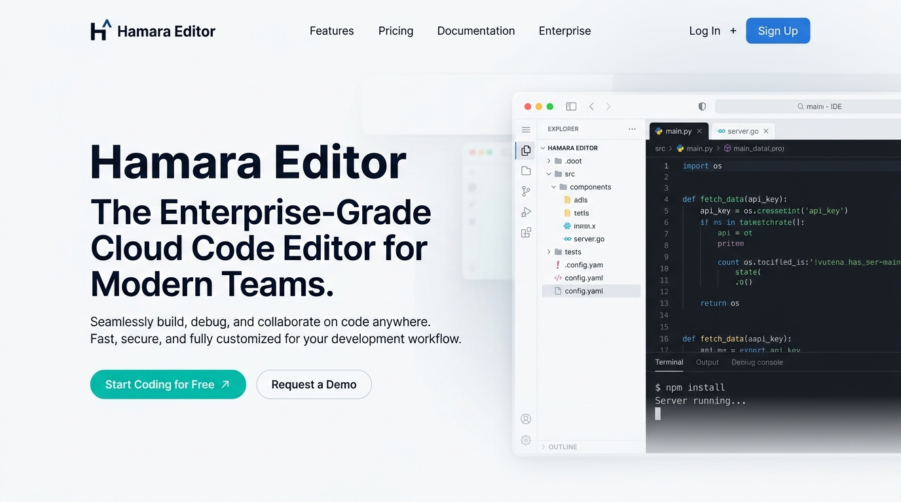
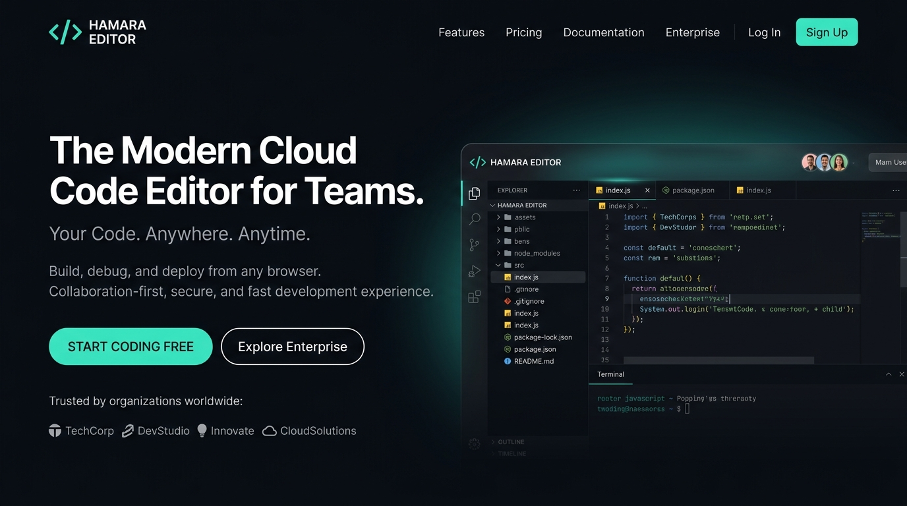
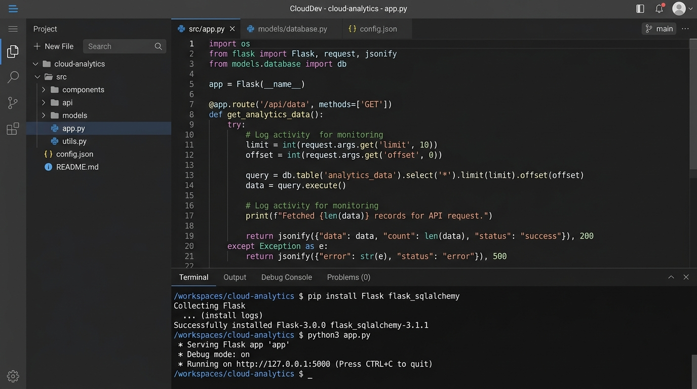
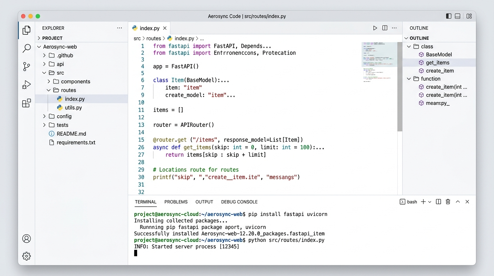
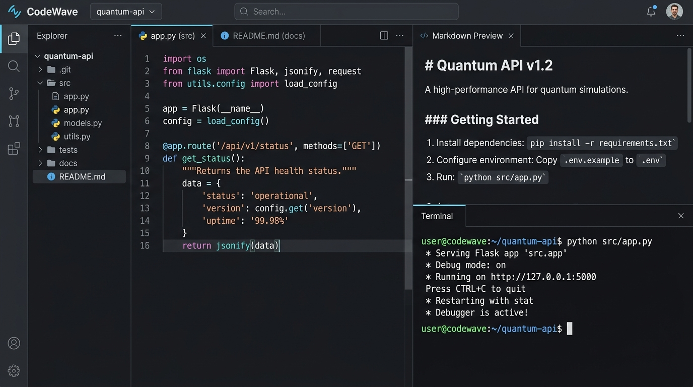
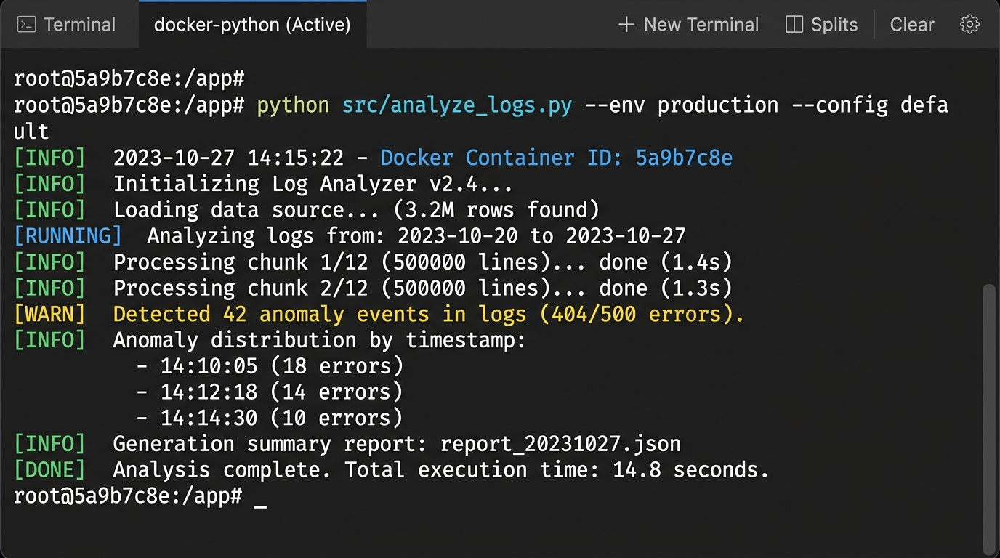
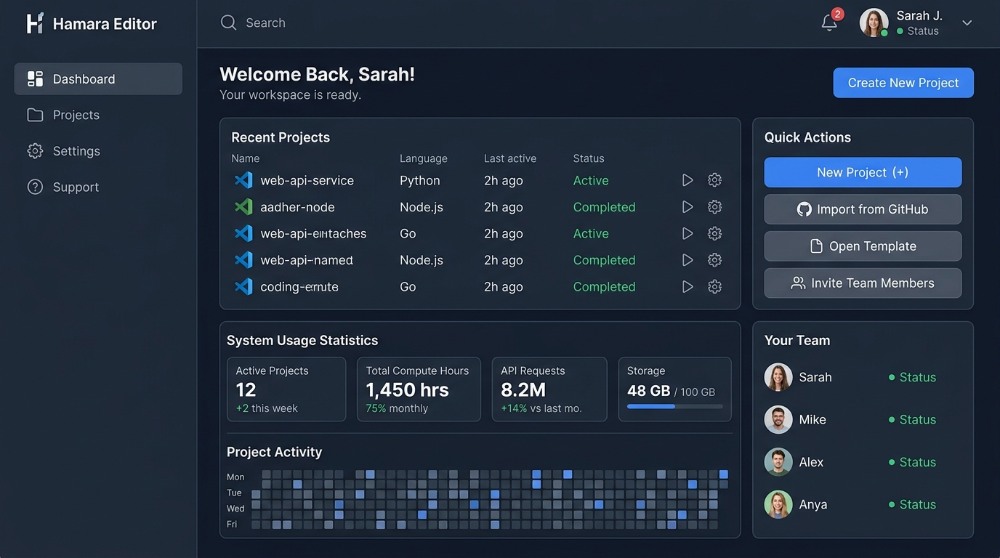
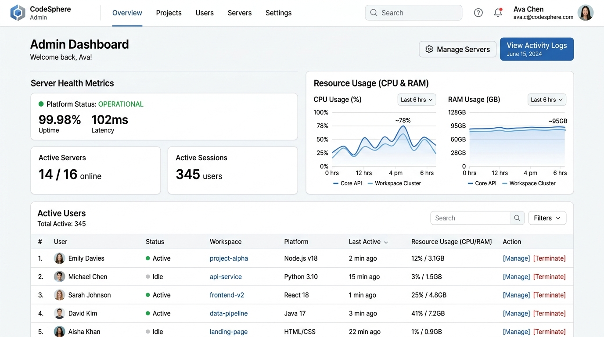
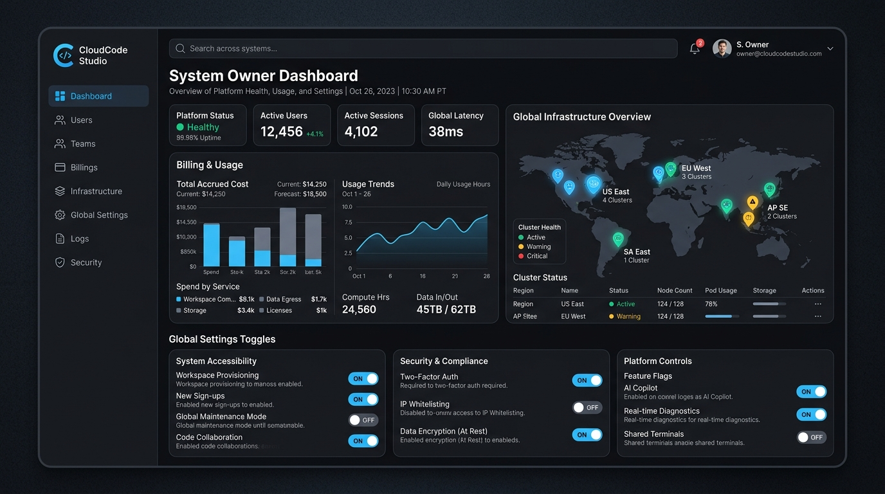
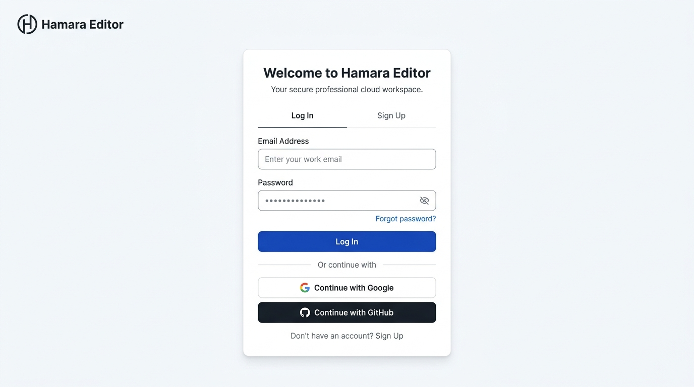

# Hamara Editor

The Open-Source, Enterprise-Grade Cloud Code Editor


<p>
  <a href="https://github.com/hamara/editor/actions"></a>
  <a href="https://github.com/hamara/editor/blob/main/LICENSE"></a>
  
  
  
  
  
</p>

---



## Project Overview

Hamara Editor is a high-performance, containerized cloud IDE built for modern teams and educators. It combines a React-based interface with a secure, highly scalable FastAPI and Docker execution engine. Write, execute, and collaborate on code entirely in the browser.

## Features

- **Fast UI**: Built with React 19, Vite, and Zustand.
- **Secure Execution Engine**: Code runs isolated in ephemeral Docker containers.
- **Enterprise Auth**: Full OAuth and RBAC using secure HTTP-only cookies.
- **Monaco Editor**: Integrated with standard VS Code engine.
- **Real-time Terminal**: Streams execution output via WebSockets.

## Screenshots

<details>
<summary>View Screenshots</summary>

| Dark Mode | Light Mode |
| :---: | :---: |
|  |  |
|  |  |
|  |  |
|  |  |
|  |  |

</details>

## Architecture

Hamara Editor follows a strictly typed, three-tier architecture. 
For detailed diagrams, visit the [Architecture Reference](docs/ARCHITECTURE/diagrams.md).

## Tech Stack

### Frontend
- **Framework:** React 19, React Router 7
- **Styling:** Tailwind CSS 4
- **State:** Zustand, React Query
- **Editor:** Monaco Editor, xterm.js

### Backend
- **Framework:** FastAPI
- **Database:** PostgreSQL 15 (SQLAlchemy ORM)
- **Migrations:** Alembic
- **Compute:** Docker Engine API

## Getting Started

### Prerequisites
- Docker & Docker Compose

### Running the Stack

1. **Clone the repository**
   ```bash
   git clone https://github.com/hamara/editor.git
   cd editor
   ```

2. **Set up Environment Variables**
   ```bash
   cp .env.example .env
   cp backend/.env.example backend/.env
   ```

3. **Start the application**
   ```bash
   docker compose up --build
   ```

4. **Access the application**
   Navigate to `http://localhost:8080`.

## Project Structure

Read the detailed [Project Structure Guide](PROJECT_STRUCTURE.md) for information on where code belongs.

## Documentation

Comprehensive documentation is available in the `docs/` directory:
- [Central Documentation Index](docs/README.md)
- [Project Overview](docs/OWNER_GUIDE/00_PROJECT_OVERVIEW.md)
- [Configuration Reference](docs/CONFIGURATION.md)

## Roadmap

See [ROADMAP.md](ROADMAP.md) for upcoming features.

## Contributing

Please see the [Contributing Guidelines](CONTRIBUTING.md) to get started. Before opening a PR, read the [Code of Conduct](CODE_OF_CONDUCT.md).

## License

This project is licensed under the MIT License - see the [LICENSE](LICENSE) file for details.

## Support

If you need help or have found a security vulnerability, refer to [SECURITY.md](SECURITY.md) or open an issue in the issue tracker.
