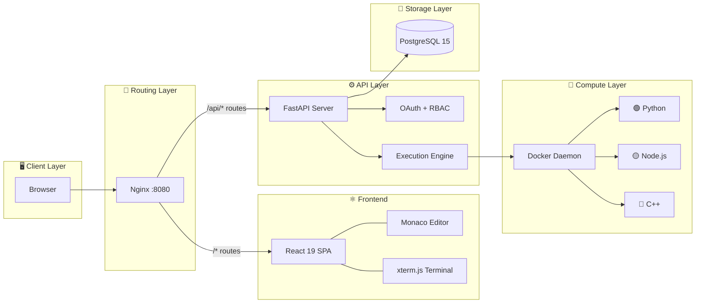
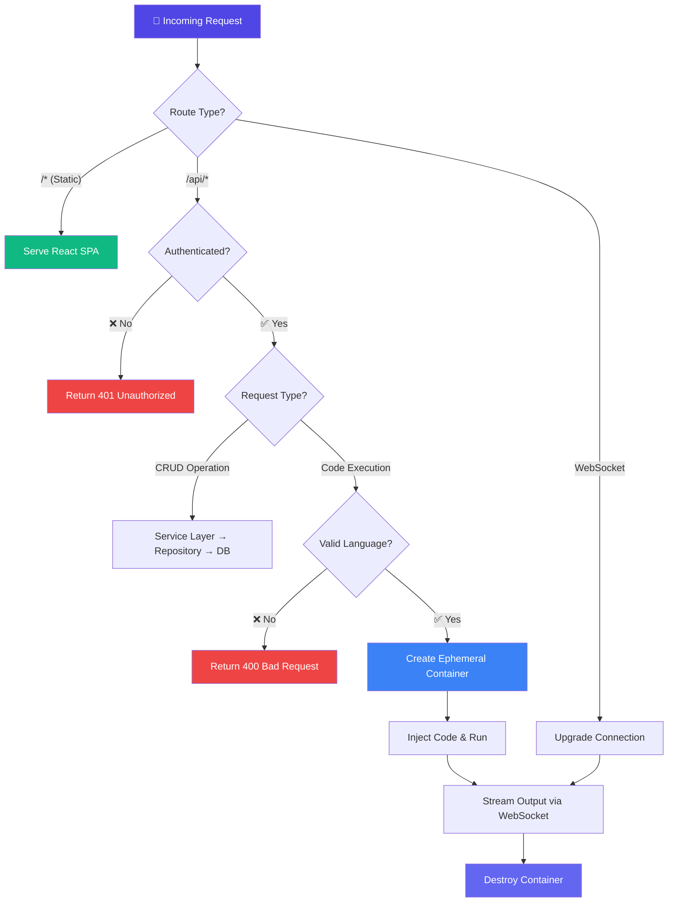
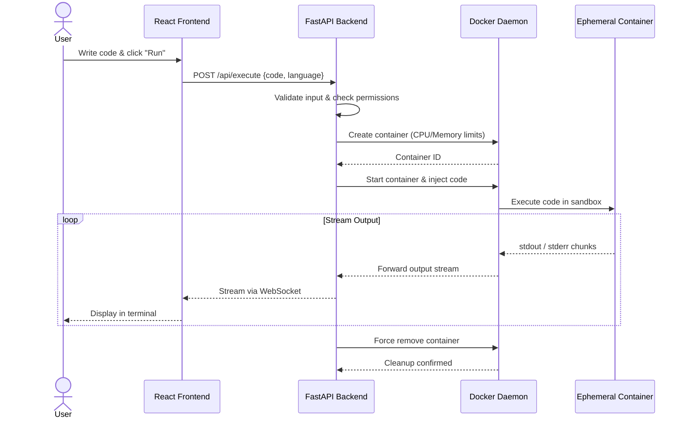

<div align="center">

# ⟨/⟩ Hamara Editor

### The Open-Source, Enterprise-Grade Cloud Code Editor

[](https://github.com/hamara/editor/actions)
[](LICENSE)
[](https://react.dev)
[](https://fastapi.tiangolo.com)
[](https://www.typescriptlang.org)
[](https://www.postgresql.org)
[](https://www.docker.com)

**Write, execute, and collaborate on code — entirely in the browser.**

[Getting Started](#-getting-started) · [Features](#-features) · [Architecture](#-architecture) · [Documentation](#-documentation) · [Contributing](#-contributing)

</div>

---

## 📋 Table of Contents

- [Overview](#-overview)
- [Features](#-features)
- [Screenshots](#-screenshots)
- [Architecture](#-architecture)
- [Code Execution Flow](#-code-execution-flow)
- [Tech Stack](#-tech-stack)
- [Getting Started](#-getting-started)
- [Project Structure](#-project-structure)
- [Documentation](#-documentation)
- [Roadmap](#-roadmap)
- [Contributing](#-contributing)
- [Security](#-security)
- [License](#-license)

---

## 🔍 Overview

Hamara Editor is a high-performance, containerized cloud IDE built for modern teams and educators. It combines a **React 19** interface with a secure, highly scalable **FastAPI** backend and a **Docker-based** code execution engine. Users can write, run, and debug code in isolated containers — all from the browser.

---

## ✨ Features

| Feature | Description |
| :--- | :--- |
| ⚡ **Blazing Fast UI** | Built with React 19, Vite, and Zustand for instant interactions |
| 🔒 **Secure Execution** | Code runs in ephemeral, resource-limited Docker containers |
| 🔑 **Enterprise Auth** | Full OAuth 2.0 + RBAC with secure HTTP-only cookie sessions |
| 📝 **Monaco Editor** | VS Code's editing engine with IntelliSense and syntax highlighting |
| 📡 **Real-time Terminal** | Live execution output streamed via WebSockets using xterm.js |
| 🎨 **Dark & Light Modes** | Beautiful themes for every preference |
| 📊 **Admin Dashboard** | Role-based dashboards for owners, admins, and users |

---

## 📸 Screenshots

<details>
<summary><b>Click to expand screenshots</b></summary>
<br>

| Dark Mode | Light Mode |
| :---: | :---: |
|  |  |
|  |  |
|  |  |
|  |  |
|  |  |

</details>

---

## 🏗 Architecture

Hamara Editor follows a strictly typed, three-tier architecture with a dedicated compute layer.

### System Overview



### Request Decision Flowchart



---

## 🐳 Code Execution Flow

This is the standout feature of Hamara Editor. User code never runs on the host — it's executed inside isolated, ephemeral Docker containers with strict resource limits.



---

## 🛠 Tech Stack

<table>
<tr>
<td valign="top" width="50%">

### Frontend
| Technology | Purpose |
| :--- | :--- |
| React 19 | UI framework |
| React Router 7 | Client-side routing |
| Tailwind CSS 4 | Utility-first styling |
| Zustand | Local state management |
| React Query | Server state & caching |
| Monaco Editor | Code editing engine |
| xterm.js | Terminal emulator |
| Framer Motion | Animations |

</td>
<td valign="top" width="50%">

### Backend
| Technology | Purpose |
| :--- | :--- |
| FastAPI | Async Python API framework |
| PostgreSQL 15 | Primary database |
| SQLAlchemy | ORM & query builder |
| Alembic | Database migrations |
| Pydantic | Data validation |
| Docker Engine API | Container orchestration |
| Nginx | Reverse proxy |

</td>
</tr>
</table>

---

## 🚀 Getting Started

### Prerequisites

- [Docker](https://docs.docker.com/get-docker/) & [Docker Compose](https://docs.docker.com/compose/install/)

### Quick Start

**1. Clone the repository**

```bash
git clone https://github.com/hamara/editor.git
cd editor
```

**2. Configure environment variables**

```bash
cp .env.example .env
cp backend/.env.example backend/.env
```

**3. Start the application**

```bash
docker compose up --build
```

**4. Open in your browser**

```
http://localhost:8080
```

> [!TIP]
> For detailed setup instructions including manual (non-Docker) installation, see the [Quick Start Guide](docs/QUICK_START.md).

---

## 📁 Project Structure

```
hamara-editor/
├── app/                  # React frontend (Vite, Tailwind, TypeScript)
├── backend/              # FastAPI backend (Auth, API, Execution Engine)
│   ├── app/              # Application code
│   │   └── execution/    # Docker-based code execution engine
│   └── alembic/          # Database migration scripts
├── docs/                 # Documentation suite
│   ├── ARCHITECTURE/     # System diagrams & design decisions
│   ├── DEPLOYMENT/       # Hosting & CI/CD guides
│   └── OWNER_GUIDE/      # Engineering handbook
├── examples/             # Code execution examples (Python, TS, etc.)
├── scripts/              # Deployment & maintenance scripts
├── tools/                # Benchmarking & stress testing utilities
├── .github/              # CI/CD workflows & issue templates
├── docker-compose.yml    # Development stack configuration
└── nginx.conf            # Reverse proxy configuration
```

> For a comprehensive breakdown, see the [Project Structure Guide](PROJECT_STRUCTURE.md).

---

## 📚 Documentation

| Document | Description |
| :--- | :--- |
| [📖 Documentation Index](docs/README.md) | Central hub for all documentation |
| [🏗 Architecture Diagrams](docs/ARCHITECTURE/diagrams.md) | Visual system design references |
| [⚙️ Configuration Reference](docs/CONFIGURATION.md) | Environment variables & config options |
| [🚀 Quick Start Guide](docs/QUICK_START.md) | Detailed setup walkthrough |
| [🔒 Security & RBAC](docs/SECURITY_AND_RBAC.md) | Auth, roles, and security policies |
| [🏠 Self-Hosting Guide](docs/SELF_HOSTING.md) | Deploy on your own infrastructure |
| [🛠 Developer Guide](docs/DEVELOPING.md) | Local development workflow |

---

## 🗺 Roadmap

| Version | Features |
| :--- | :--- |
| **v2** | LSP integration · Multi-file workspaces · Custom env variables · Java/C++ support |
| **v3** | Real-time collaboration (CRDTs) · Project sharing · Ephemeral SQLite per session |
| **Future** | AI copilot · AI-driven debugging · Voice/video chat · Classroom mode for educators |

> See the full [Roadmap](ROADMAP.md) for details.

---

## 🤝 Contributing

We welcome contributions from the community! Here's how to get started:

1. **Fork** the repository
2. **Create** your feature branch (`git checkout -b feat/amazing-feature`)
3. **Commit** your changes (`git commit -m 'feat: add amazing feature'`)
4. **Push** to the branch (`git push origin feat/amazing-feature`)
5. **Open** a Pull Request

> [!IMPORTANT]
> Before contributing, please read the [Contributing Guidelines](CONTRIBUTING.md) and [Code of Conduct](CODE_OF_CONDUCT.md).

---

## 🔒 Security

If you discover a security vulnerability, please report it responsibly. **Do not open a public issue.** Instead, refer to our [Security Policy](SECURITY.md) for instructions.

---

## 📄 License

This project is licensed under the **MIT License**. See the [LICENSE](LICENSE) file for details.

---

<div align="center">

**Built with ❤️ by the Hamara Editor team**

⭐ Star this repo if you find it useful!

</div>
