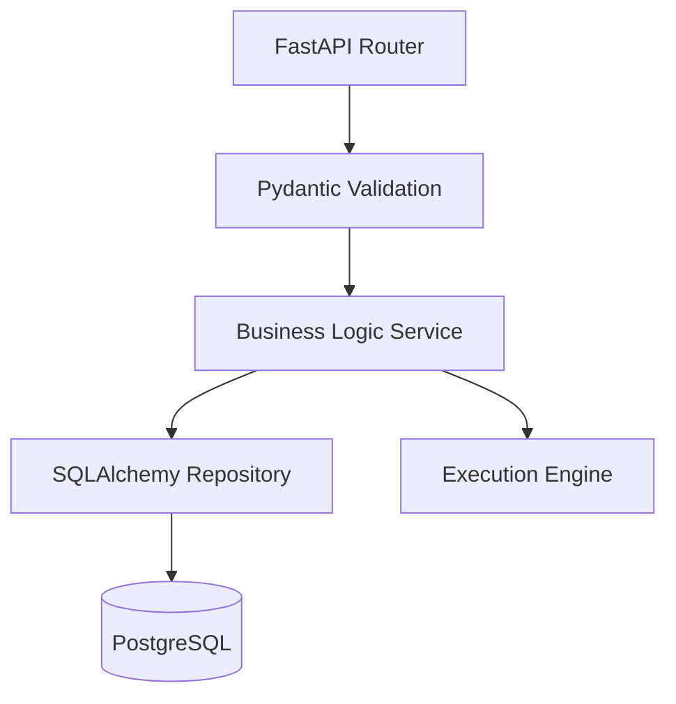
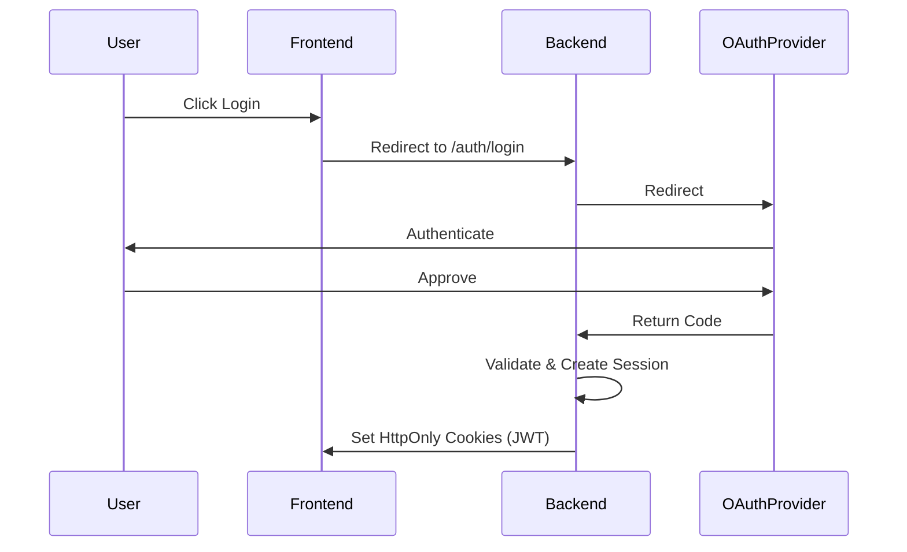
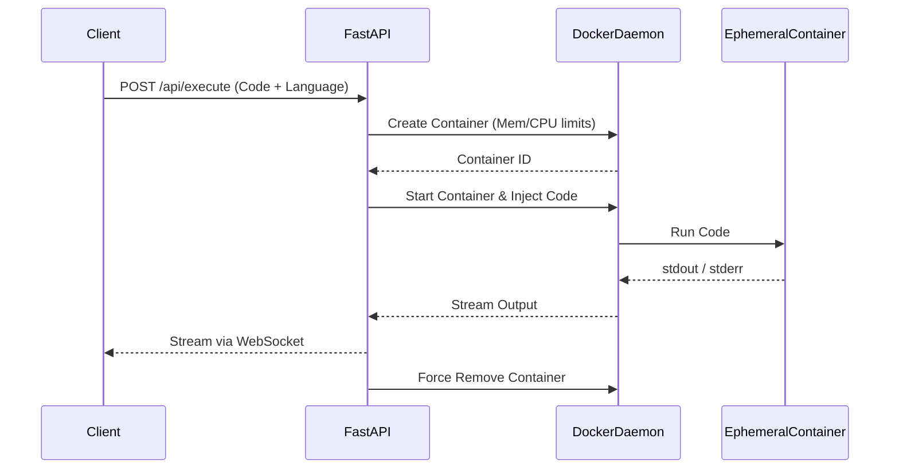
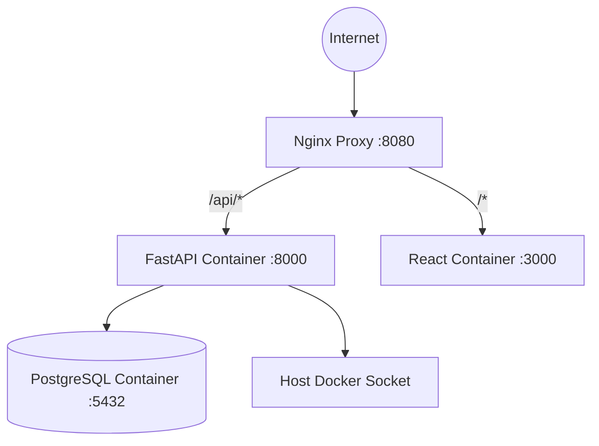

# Architectural Diagrams

These diagrams provide a high-level visual understanding of Hamara Editor's core systems.

## 1. Repository Structure

```mermaid
graph TD
    Root[Hamara Editor Repository]
    Root --> App[app/ (React Frontend)]
    Root --> Backend[backend/ (FastAPI)]
    Root --> Docs[docs/ (Documentation)]
    Root --> Scripts[scripts/ & tools/]
    Root --> Examples[examples/]
    Root --> Github[.github/ (CI/CD)]
    
    Backend --> Alembic[alembic/ (Migrations)]
    Backend --> Exec[app/execution/ (Engine)]
```

## 2. Frontend Architecture

```mermaid
graph TD
    UI[React Components] --> Zustand[Zustand Stores (Local State)]
    UI --> RQ[React Query (Server State)]
    RQ --> API[Axios/Fetch Client]
    UI --> Monaco[Monaco Editor]
    UI --> Xterm[xterm.js Terminal]
```

## 3. Backend Architecture



## 4. Authentication Flow



## 5. Execution Engine Flow



## 6. Docker & Deployment Topology


